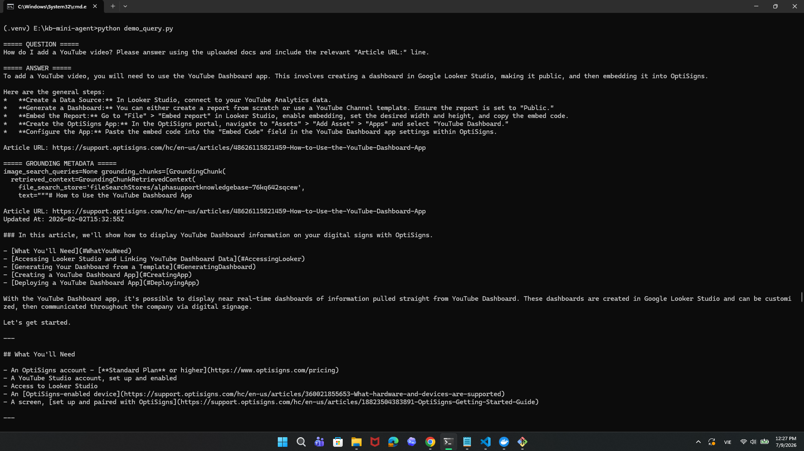

# KB Mini Agent

Mini RAG pipeline that scrapes 30+ support articles from `support.optisigns.com`, converts them to clean Markdown, uploads new/updated files to Gemini File Search Store via API, and runs as a daily scheduled job.

## Features

- Scrape 30+ support articles.
- Convert HTML articles to Markdown with title, headings, links, code blocks, and `Article URL:`.
- Detect added, updated, and skipped articles using SHA-256 hash.
- Upload only new or updated articles to Gemini File Search Store.
- Run locally, with Docker, and as a GitHub Actions daily job.

## Setup

```bash
python -m venv .venv
.venv\Scripts\activate
pip install -r requirements.txt
```

Create `.env`:

```env
GEMINI_API_KEY=
GEMINI_FILE_SEARCH_STORE_NAME=
GEMINI_MODEL=gemini-2.5-flash-lite
MAX_ARTICLES=30
UPLOAD_TO_GEMINI=true
CHUNK_SIZE_TOKENS=512
CHUNK_OVERLAP_TOKENS=100
```

## Run

```bash
python main.py
```

The job re-scrapes articles, converts them to Markdown, detects added/updated/skipped articles, uploads only the delta, and writes logs to `logs/last_run.json`.

Demo query:

```bash
python demo_query.py
```

Sample question: `How do I add a YouTube video?`

## Docker

```bash
docker build -t kb-mini-agent .
docker run --env-file .env kb-mini-agent
```

The container runs `main.py` once and exits.

## Daily Job

GitHub Actions workflow: `.github/workflows/daily.yml`

Schedule:

```cron
0 0 * * *
```

Daily job log:  
https://github.com/minhkhoagithub/kb-mini-agent/actions/runs/28995063417/artifacts/8189411325

## Chunking Strategy

Each article is saved as one Markdown file. Gemini File Search uses whitespace chunking with `512` tokens per chunk and `100` overlapping tokens.

## Screenshot

